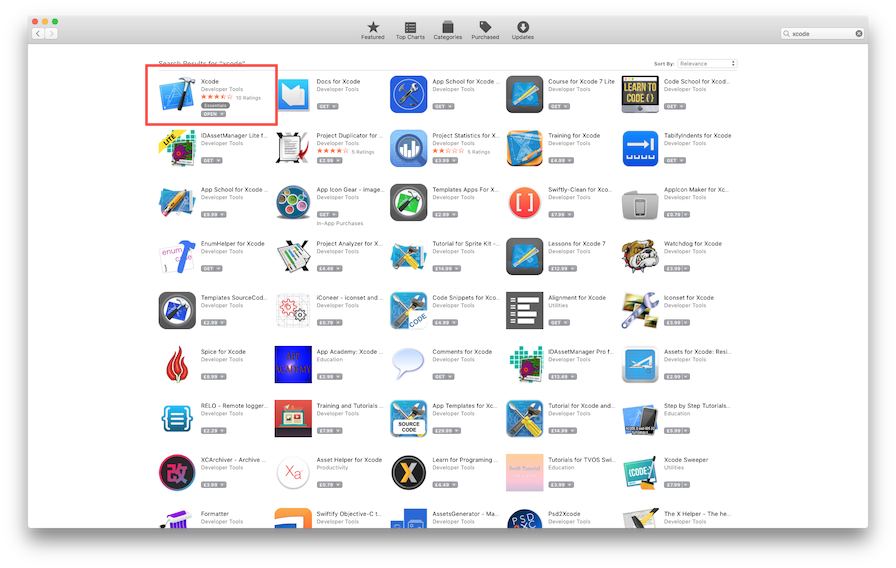
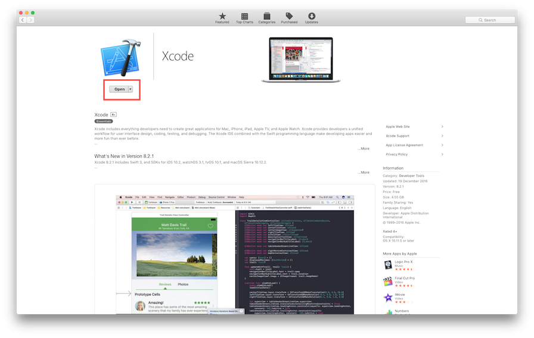
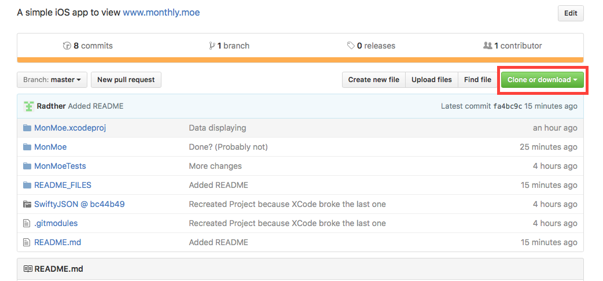
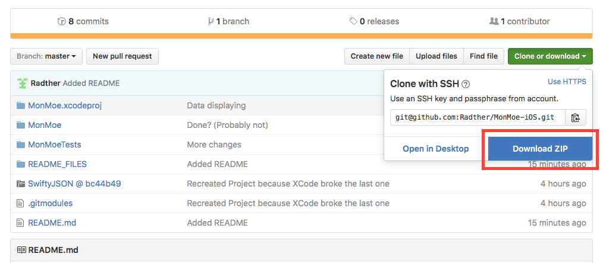
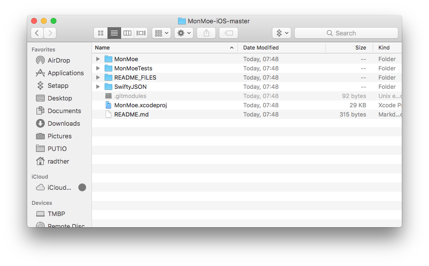
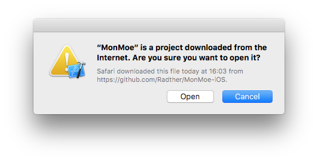
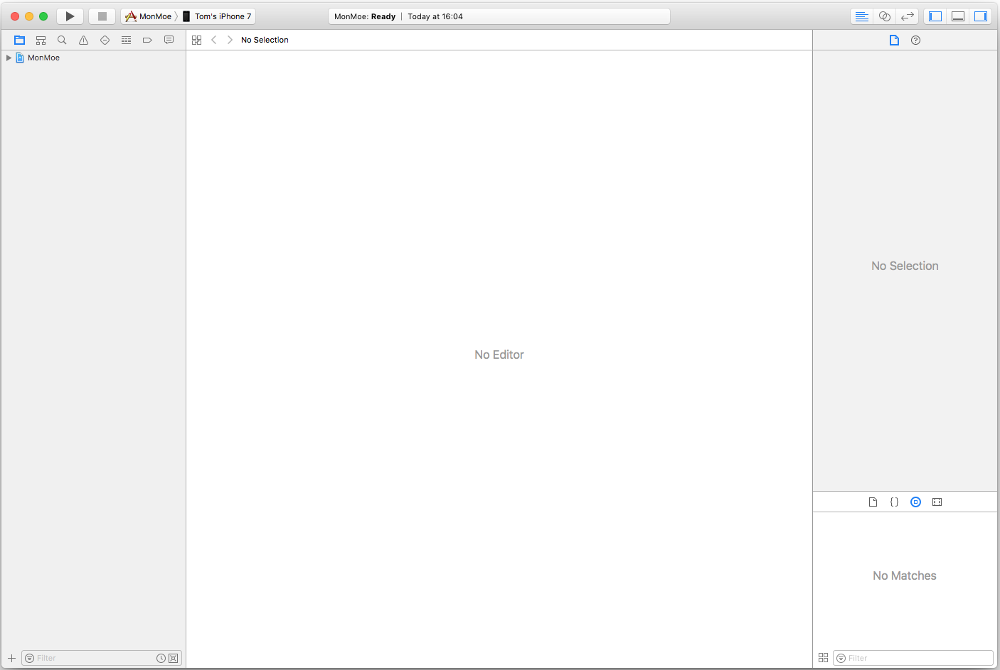
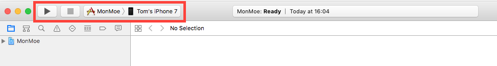

# MonMoe-iOS

This is a quickly built iOS app to view the current month. The data is collected from[MONTHLY.MOE](https://www.monthly.moe/). This app was very quickly put together and is not a good example of application architecture!

## Screenshots

## Instalation

To install this app you will **need** a Mac. 

### 1. Install Xcode

First you will need to install Xcode, which can be done through the Mac App Store.

In the search bar at the top right type `xcode` and hit enter.

Then click the first result called `Xcode`.

Lastly hit the install button.

### 2. Download the app files

Once Xcode is installed you need to download the app files. To do this click the green button at the top of the page labeled `Clone or download`.

Followed by the `Download ZIP` button.

Extract the `ZIP` file (safari does this for you) and open up the folder. You should see something that looks like this: 

### 3. Run the project

Double click the `MonMoe.xcodeproj` to open up the Xcode project (Xcode must be installed for this to open). It will give you the following dialog. Assuming you trust me click `Open`.

Once the project loads Xcode will look something like this: 

If it has opened a file or looks slightly different that's fine, we only care about the bit at the top: 

Plug your phone in and where it says `Simulator` change it to your phone. Xcode will probably have to process symbols, just leave it for a bit and once it's finished select the play button. This will build the app and install it on the phone. 

### 4. Relax and look at the anime calendar

That's it. All done. Any questions don't be afraid to ask. You can contact me on Reddit at: [tomblade13](https://www.reddit.com/user/tomblade13/).