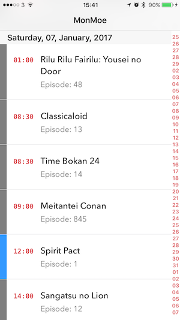

# MonMoe-iOS

This is a quickly built iOS app to view the current month. The data is collected from[MONTHLY.MOE](https://www.monthly.moe/). This app was very quickly put together and is not a good example of application architecture!

## Screenshots

